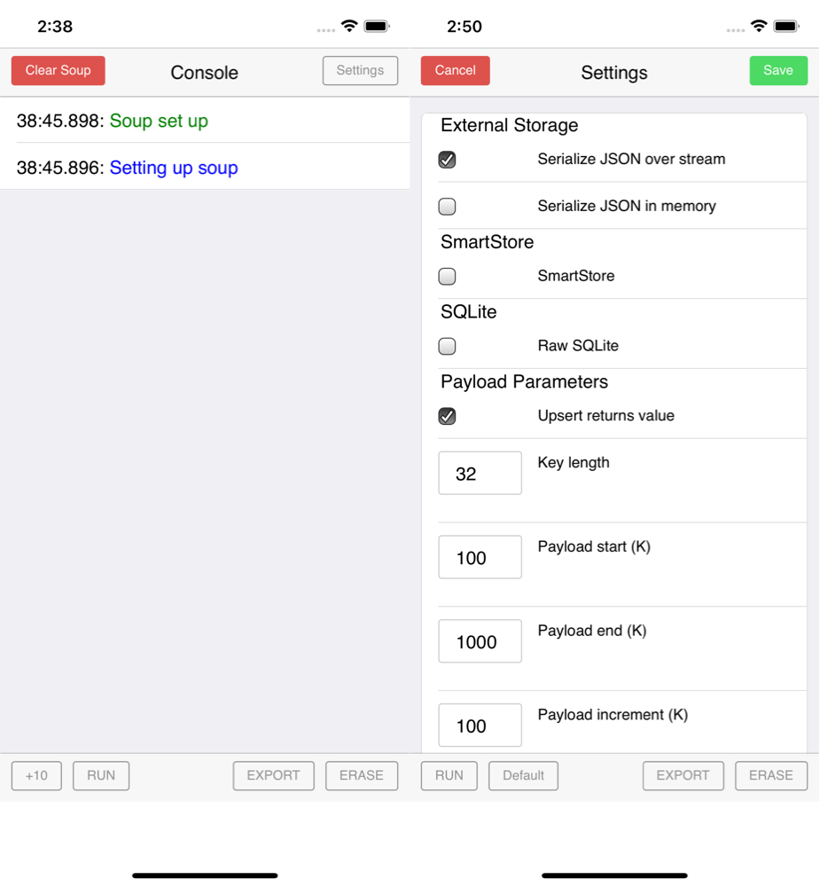

# Simple application that tries to corrupt SmartStore

## Overview

 

### Console screen:
Buttons
- settings: to edit settings
- clear soup: to empty the soup
- +10, +100: to insert 10 or 100 large records. The size of records inserted (and the time it took are reported)
- Q 1 by 1, Q 10 by 10: to query all records from the soup with a page size of 1 and 10 respectively. The number of records founds / expected (and the time it took) are reported.

Screen shows ouput for most recent operation first.
- Blue is for the beginning of a add/query operation
- Green is for the end of a add/query operation
- Red is for window.onerror messages

Through the settings screen one can control the shape of the record and whether to use external storage or not:
- use external storage: whether to use external storage or not
- depth: depth of json objects
- number of children: number of branches at each level of the json object
- key length: length of keys in json object
- value length: length of leaf values in json object
- min/max character code: smallest/largest character code to use in random strings generated for keys and leaf value
NB: if you change the storage type, the soup gets recreated

## Issues discovered
- Bug in `saveSoupEntryExternally` (see https://github.com/forcedotcom/SalesforceMobileSDK-iOS/pull/2982 for details)

## First time setup
After cloning this repo, you should do:
```shell
./install.sh
```
NB: you need forcehybrid installed.

## Running the application
To bring up the application in XCode do:
```shell
open ./app/platforms/ios/CorruptionTester.xcworkspace
```

## Modifying the application locally
Edit files in `./app/platforms/ios/www/`.
If you have Safari web inspector connected (more info [here](https://developer.apple.com/library/archive/documentation/AppleApplications/Conceptual/Safari_Developer_Guide/GettingStarted/GettingStarted.html)), you can simply do a `reload`. You don't need to relaunch the application.

## Modifying the application for github
Copy any files you changed from to `./app/platforms/ios/www/` to `./www`.

## Pointing to a different version of the Mobile SDK
Simply edit `./app/platforms/ios/Podfile` and change where to get the libraries from.
For instance, if you used forcehybrid 7.2, it would look something like:
```ruby
platform :ios, '11.0'
use_frameworks!
target 'CorruptionTester' do
	pod 'SalesforceHybridSDK', :git => 'https://github.com/forcedotcom/SalesforceMobileSDK-iOS-Hybrid', :tag => 'v7.2.0'
	pod 'Cordova', :git => 'https://github.com/forcedotcom/cordova-ios', :branch => 'cordova_5.0.0_sdk'
	pod 'SmartSync', :git => 'https://github.com/forcedotcom/SalesforceMobileSDK-iOS', :tag => 'v7.2.0'
	pod 'SmartStore', :git => 'https://github.com/forcedotcom/SalesforceMobileSDK-iOS', :tag => 'v7.2.0'
	pod 'FMDB/SQLCipher', :git => 'https://github.com/ccgus/fmdb', :tag => '2.7.5'
	pod 'SQLCipher/fts', :git => 'https://github.com/sqlcipher/sqlcipher', :tag => 'v4.2.0'
	pod 'SalesforceSDKCore', :git => 'https://github.com/forcedotcom/SalesforceMobileSDK-iOS', :tag => 'v7.2.0'
	pod 'SalesforceAnalytics', :git => 'https://github.com/forcedotcom/SalesforceMobileSDK-iOS', :tag => 'v7.2.0'
	pod 'SalesforceSDKCommon', :git => 'https://github.com/forcedotcom/SalesforceMobileSDK-iOS', :tag => 'v7.2.0'
end
```

## Looking at the externally stored files (when using simulator)
First find the directory for that soup:
```shell
cd ~/Library/Developer/CoreSimulator/Devices/
find . -name TABLE_1
```
Disable encrypting of externally stored files by editing `SFSmartStore.m`, replace `SFSmartStoreEncryptionKeyBlock keyBlock = [SFSmartStore encryptionKeyBlock];` with `SFSmartStoreEncryptionKeyBlock keyBlock = nil;` in:
- `loadExternalSoupEntryAsString:soupTableName` 
- `saveSoupEntryExternally:soupEntryId:soupTableName`

To pretty a json file do:
```shell
cat soupelt_xxx | python -mjson.tool
```
